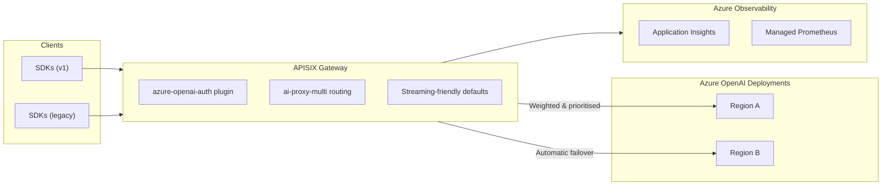

# APISIX Azure GenAI Accelerator

High-throughput Azure OpenAI workloads need a traffic brain. This accelerator delivers an Azure-native APISIX gateway that load balances across multiple Azure OpenAI deployments, fails over automatically, and keeps client integrations unchanged—whether they call the modern `/openai/v1/*` endpoints or legacy `openai.azure.com` routes.

## Why it matters

- **Protect throughput**: survive regional throttling (429) and backend errors (5xx) with transparent failover.
- **Stay compatible**: support both modern bearer tokens and legacy Azure API keys, so no SDK rewrites are required.
- **Add guardrails**: toggle rate limits, quotas, OIDC, IP controls, and CORS per environment.
- **See everything**: ship metrics, traces, and logs with Azure-native tooling out of the box.
- **Deploy consistently**: opinionated Terraform stacks + CLI workflow deliver repeatable environments.
- **Iterate fast**: tweak Container App settings, restart, and let the built-in configuration engine regenerate gateway and observability assets without touching the image or code.
- **Run control-plane free**: APISIX operates in standalone (data-plane) mode, so there is no etcd cluster or Admin API to secure, scale, or back up—immutable configs are rendered ahead of time and picked up atomically on boot.
- **Keep costs predictable**: Azure Container Apps delivers per-second consumption with automatic scale-to-zero, avoiding the standing control-plane cost that AKS or VM-based APISIX deployments incur when traffic is low.
- **Scale without Kubernetes**: vertical sizes and replica counts are exposed directly in Terraform/CLI knobs, so increasing GPT capacity is as simple as bumping ACA CPU/memory or max replicas rather than provisioning node pools.

## What you get

| Layer                 | Highlights                                                                                                                                                                                      |
| --------------------- | ----------------------------------------------------------------------------------------------------------------------------------------------------------------------------------------------- |
| Gateway runtime       | Apache APISIX with a purpose-built Azure OpenAI authentication layer, streaming-friendly defaults, multi-backend routing                                                                       |
| Configuration agility | Environment-driven definitions let you add/remove Azure OpenAI backends, rotate secrets, or toggle guardrails without touching code; the gateway picks up changes on restart or redeploy        |
| Infrastructure        | Four Terraform stages cover remote state, platform and networking, optional Azure OpenAI provisioning, and the workload deployment                                                              |
| Automation            | Built-in deployment script orchestrates Terraform stages, image builds, configuration sync, and rollout end-to-end                                                                               |
| Tooling               | Mock Azure OpenAI service, pytest suites, Grafana dashboards, and OpenTelemetry collector templates                                                                                             |

## Architecture snapshot

- **Traffic control**: APISIX routes by priority, weight, or session affinity, with active/passive health checks maintaining availability.
- **Security**: API key validation accepts both header styles, separates client credentials from backend secrets, and integrates with Key Vault or OIDC if required.
- **Observability**: Prometheus metrics (LLM-aware labels), Application Insights traces/logs, Managed Prometheus dashboards, and structured JSON logs for the OpenTelemetry collector.
- **Rapid restarts**: the configuration engine re-renders gateway and observability assets on every Container Apps restart, so adding a backend is as simple as updating settings and cycling the revision.
- **Transparent AI driver**: our Azure OpenAI-aware proxy streams responses untouched while emitting backend identifiers, retry intent, and token accounting so Prometheus and App Insights stay accurate.
- **Dynamic configuration**: gateway backends, weights, secrets, and feature toggles are driven by environment variables—no manual yaml edits required when you add or remove Azure OpenAI deployments.
- **Environment awareness**: feature flags drive optional modules (rate limits, quotas, caching) so dev, staging, and prod can diverge safely.
- **Immutable-by-default operations**: configuration is produced by hydrenv, stored on a shared volume, and copied into APISIX as part of container start-up, guaranteeing declarative rollbacks and easy diffing in Git.
- **Zero external control plane**: because the Admin API is disabled, there is no runtime API exposure or control-plane autoscaling to worry about; runtime blast radius stays limited to the Container App revision.

## Feature spotlights

- **Config without redeploys** – the dynamic configuration engine reads platform app settings and secret stores to regenerate gateway policies and telemetry wiring every time the service restarts. Add a new Azure OpenAI backend, bounce the revision, and traffic flows with no image rebuilds.
- **Azure OpenAI Smart Proxy** – our custom streaming layer preserves responses while collecting the signals needed for regional failover decisions, token accounting, and rich observability.
- **Azure OpenAI API coverage** – out of the box we serve both legacy and v1 chat completions, embeddings, and the modern responses API, all with shared guardrails and analytics.
- **FinOps-ready dashboard** – the bundled Grafana view translates token consumption into cost, highlights failover events, and surfaces latency trends so finance and product teams can steer spend.

## Token-aware rate limiting

- Toggle the built-in APISIX `ai-rate-limiting` plugin via env: `ENABLE_AI_RATE_LIMIT` (default `false`), `AI_RATE_LIMIT_STRATEGY` (`total_tokens` \| `req`, default `total_tokens`), `AI_RATE_LIMIT_WINDOW_SECONDS` (default `60`), `AI_RATE_LIMIT_HIGH_LIMIT` (default `200`), `AI_RATE_LIMIT_LOW_LIMIT` (default `20`), `AI_RATE_LIMIT_REJECT_CODE` (default `503`), and `AI_RATE_LIMIT_REJECT_MESSAGE` (default `"rate limited"`). Configure per environment without code edits.
- High-limit buckets cover the standard AI routes; low-limit buckets apply to the `/prioritization-simple` low-priority branch so toolkit parity tests can observe distinct ceilings.
- In E2E/test mode (`GATEWAY_E2E_TEST_MODE=true`) a lightweight header shim renames APISIX rate-limit headers to APIM-style fields, emitting `x-gw-priority` (from `x-priority`, default `high`) and `x-gw-remaining-tokens` (from `X-AI-RateLimit-Remaining` or `X-RateLimit-Remaining`) only on test-prefixed routes; production headers remain unchanged.

## Why not run the full APISIX control plane on AKS?

| Aspect | This accelerator (ACA, standalone APISIX) | Traditional APISIX on AKS + control plane |
| --- | --- | --- |
| **Baseline monthly cost** | ~USD $45–$60 for a single 0.5 vCPU/1 Gi gateway revision that can scale to zero between bursts. No control-plane meters. | USD $70+ for AKS control plane even with zero pods, plus at least one system node pool (≈$250 for two DS2_v2 nodes) and VM-based etcd/control-plane workers. Typical steady-state ≈$320–$400/month before traffic. |
| **Configuration flow** | Immutable hydrenv templates rendered on start, committed in Git, diff-friendly. No Admin API to guard. | Requires exposing the APISIX Admin API (and sometimes etcd directly) plus a CI/CD controller to push declarative changes at runtime. |
| **Operational blast radius** | Only the gateway Container App revision; restart regenerates configs and restarts the data plane. | Must monitor and patch AKS, etcd, and the APISIX control plane. A misconfigured Admin API call can affect every node immediately. |
| **Scaling** | Configure min/max replicas or CPU/memory per revision. ACA scales instances automatically, including down to zero. | Need to manage AKS node pools, cluster autoscaler, and DaemonSet footprints before APISIX can scale. |
| **Security surface** | No long-lived control endpoints; only the public gateway ingress (optional) plus Azure Monitor endpoints. | Requires locking down the Admin API, etcd, the Kubernetes API server, and associated credentials. |

When you only need a resilient traffic brain in front of Azure OpenAI, paying for a 24x7 Kubernetes control plane, etcd quorum, and node pools is unnecessary overhead. The accelerator’s ACA-first design keeps the entire deployment in a single managed service, lets you scale based on real traffic, and preserves a declarative, source-controlled configuration story without adding a bespoke control plane to operate.

## Deploy in two ways

1. **Scripted workflow (recommended)** – run the included deployment script to build images, apply Terraform stages, sync configuration, and deploy the workload. An optional switch lets you target existing Azure OpenAI resources when you don’t want to provision new ones.
2. **Manual workflow** – follow the deployment guide’s Terraform and image checklist when you want complete control over each command.

Both paths rely on the same set of environment configuration templates and Terraform variables, so switching between them is simple.

## Quick start checklist

1. Confirm your subscription can create the required Azure resources (Container Apps, Azure OpenAI in the chosen regions, ACR, Key Vault, Application Insights, Azure Monitor).
2. Decide whether you want the automation to provision Azure OpenAI instances or connect to ones that already exist.
3. Complete the supplied environment configuration templates for operational settings and secrets, then run the environment sync helper to push values into Azure Developer CLI and Key Vault.
4. Execute the deployment script or follow the manual checklist, then validate traffic flow, failover, and telemetry in your target environment.

## Documentation map

- Deployment Guide – covers both the scripted workflow and the manual Terraform/image path.
- Roadmap – outlines upcoming enhancements such as Kubernetes packaging and managed identity backend auth.
- Configuration Guide – explains how to prepare environment settings, secrets, and Key Vault sync.
- Dynamic Configuration Guide – details how the rendering engine bootstraps gateway configuration at runtime.

## Feedback

Open an issue to report bugs, suggest enhancements, or share deployment experiences. Contributions that improve documentation, automation, or observability are encouraged.
