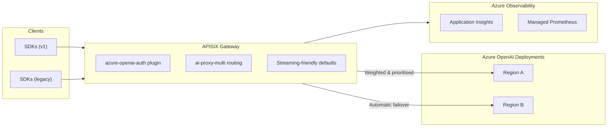

# APISIX Azure GenAI Accelerator

Tired of HTTP **429** throttling turning your agentic apps and coding agents with “try again later”? This repo gives you a fast, **drop-in APISIX GenAI gateway for Azure** that sits in front of **multiple Azure OpenAI backends** and **fails over automatically on 429/5xx** (within the same request), routing traffic to wherever capacity exists.

This works because **Azure OpenAI capacity and rate limits are largely scoped by region in practice** → using multiple regions effectively gives you multiple capacity pools. See: **[Quotas, regions, and deployments (Azure OpenAI / Foundry)](docs/azure-openai-quotas-regions-deployments.md)**.

> [!NOTE] > **TL;DR:** This is an Apache APISIX-based, full featured high‑performance Layer‑7 API gateway built on Nginx/OpenResty with full APIM-parity.

---

## Table of contents

- [What you get](#what-you-get)
- [Quickstart (deploy to Azure Container Apps)](#quickstart-deploy-to-azure-container-apps)
- [Supported APIs & paths](#supported-apis--paths)
- [How retries/failover work](#how-retriesfailover-work)
- [Configure without rebuilding images (dynamic config)](#configure-without-rebuilding-images-dynamic-config)
- [Token-aware rate limiting (optional)](#token-aware-rate-limiting-optional)
- [Observability (what you’ll-see)](#observability-what-youll-see)
- [Why “standalone APISIX on Container Apps” (cost + ops)](#why-standalone-apisix-on-container-apps-cost--ops)
- [E2E test mode (optional)](#e2e-test-mode-optional)
- [Common knobs](#common-knobs)
- [Feedback / contributions](#feedback--contributions)

---

## What you get

- **Fewer 429s, fewer outages:** automatic in-request retry/failover across backends on **429** and **5xx**
- **Works with streaming (SSE) and non-streaming** responses
- **Supports modern + legacy client routes:** OpenAI-style `/openai/v1/*` **and** Azure-style `/openai/deployments/*`
- **Priority lanes:** send `x-priority: high|low` to separate critical traffic from background load
- **Client auth compatibility:** accepts `Authorization: Bearer …`, `api-key: …`, or `ocp-apim-subscription-key: …`
- **Token-aware rate limiting (optional):** limit by requests or total tokens in a time window
- **Observability built-in:** Azure Monitor Logs + Prometheus-style metrics (with backend identifiers) and a sample Grafana dashboard you can connect to Azure Monitor
- **Azure-native deployment:** Terraform + Azure Container Apps (gateway + config renderer + OTel collector)
- **Parity confidence:** we run tests against the official APIM E2E suite by the **APIM GenAI gateway toolkit** scenarios (routing, retries, failover, latency preference). See: **[E2E tests + APIM parity (with sample run output)](docs/e2e-tests-apim-parity.md)**

---

## Quickstart (deploy to Azure Container Apps)

### Prereqs

You’ll need:

- An Azure subscription with permission to create: Resource Groups, ACR, Key Vault, Container Apps, Log Analytics / Azure Monitor resources
- `az` (Azure CLI) authenticated
- `terraform` (>= 1.9)
- `uv` (Astral)

Optional:

- `docker` (only if you want local image builds; otherwise images are built in ACR via `az acr run`)

---

### 1) Login + choose an environment code

Pick a short environment name like `dev`, `stg`, or `prod`:

```bash
export ENV=dev

az login
az account set --subscription <YOUR_SUBSCRIPTION_ID>
```

---

### 2) Deploy platform prerequisites (state + observability + shared platform)

These commands create remote state storage, shared observability (Log Analytics, Azure Monitor workspace, Application Insights), ACR, and Key Vault used by the rest of the deployment:

```bash
uv run deploy-bootstrap      "$ENV"   # terraform backend storage
uv run deploy-observability  "$ENV"   # shared Log Analytics / Azure Monitor / App Insights
uv run deploy-platform       "$ENV"   # ACR, Key Vault, identities
```

---

### 3) Configure your backends + gateway client keys

Edit your environment configuration:

- `config/appsettings.$ENV.env` → non-secrets (endpoints, weights, names, feature flags)

Create your environment secrets:

- `config/secrets.$ENV.env` → secrets (backend keys, gateway client keys)

Notes:

- Add more gateway clients by incrementing the index:

  - `GATEWAY_CLIENT_NAME_0`, `GATEWAY_CLIENT_KEY_0`
  - `GATEWAY_CLIENT_NAME_1`, `GATEWAY_CLIENT_KEY_1`
  - …and so on (sequential, no gaps)

- Add more backends the same way:

  - `AZURE_OPENAI_ENDPOINT_0`, `AZURE_OPENAI_KEY_0` (and optional `AZURE_OPENAI_NAME_0`, `AZURE_OPENAI_WEIGHT_0`)
  - `AZURE_OPENAI_ENDPOINT_1`, `AZURE_OPENAI_KEY_1`, …

---

### 4) (Optional) Provision Azure AI Foundry / Azure OpenAI

If you want Terraform to stand up Azure AI Foundry/OpenAI resources instead of bringing your own endpoints, run:

```bash
uv run deploy-foundry "$ENV"
```

### 5) Deploy the gateway (and build/push images)

This command:

- syncs your config/secrets into Key Vault,
- builds/pushes container images (remote ACR build by default),
- deploys the Container Apps workload.

```bash
uv run deploy-workload "$ENV"
```

---

### 6) Send your first request

Use **any** of the supported client auth headers:

- `Authorization: Bearer <GATEWAY_CLIENT_KEY_N>`
- `api-key: <GATEWAY_CLIENT_KEY_N>`
- `ocp-apim-subscription-key: <GATEWAY_CLIENT_KEY_N>`

Example (Azure OpenAI-style path; you supply your deployment name + api-version):

```bash
export GATEWAY_URL="..."
export GW_KEY="<GATEWAY_CLIENT_KEY_0>"
export DEPLOYMENT="<YOUR_AZURE_OPENAI_DEPLOYMENT>"
export API_VERSION="<YOUR_AZURE_OPENAI_API_VERSION>"

curl -sS "$GATEWAY_URL/openai/deployments/$DEPLOYMENT/chat/completions?api-version=$API_VERSION" \
  -H "Authorization: Bearer $GW_KEY" \
  -H "Content-Type: application/json" \
  -d '{
    "messages": [{"role":"user","content":"Say hello in one sentence."}],
    "temperature": 0.2
  }'
```

If one backend returns **429/5xx**, the gateway will transparently try another configured backend (within the same request) until it succeeds or all options are exhausted.

---

## Supported APIs & paths

You can keep existing integrations—this gateway is designed to be “boring” from the client’s perspective.

- **OpenAI-style (v1)**: `/openai/v1/*` (including the **Responses API**)
- **Azure OpenAI-style (legacy)**: `/openai/deployments/*` with `?api-version=...`

Both styles run through the same routing, retries/failover, priority handling, and observability.

---

## How retries/failover work

The gateway uses APISIX `ai-proxy-multi` with a custom **dynamic Azure OpenAI driver**. When a backend responds with **429** or **5xx**, the driver does **not** proxy that response body back to the client; it returns the status to APISIX so another backend can be tried immediately. On success, the gateway streams status/headers/body from the winning backend (including SSE), and records backend identifiers + error status for observability.



---

## Configure without rebuilding images (dynamic config)

You shouldn’t have to redeploy code just to rotate keys, add a backend, or tweak weights.

This accelerator runs APISIX in **standalone mode** and includes a config renderer that regenerates the gateway + telemetry config from environment settings/secrets.

Typical flow:

1. Update `config/appsettings.$ENV.env` and/or `config/secrets.$ENV.env`
2. Run your normal workload deploy (or sync step, depending on your workflow)
3. **Restart / roll a new Container App revision**
4. APISIX picks up the newly rendered config on boot

Practical examples of changes that don’t require code edits:

- add/remove an Azure OpenAI backend
- change weights / priority behavior
- rotate gateway client keys
- enable token-aware rate limiting
- toggle guardrails per environment (dev vs prod)

---

## Token-aware rate limiting (optional)

Toggle the built-in APISIX `ai-rate-limiting` plugin via env:

- `ENABLE_AI_RATE_LIMIT` (default `false`)
- `AI_RATE_LIMIT_STRATEGY` (`total_tokens` | `req`, default `total_tokens`)
- `AI_RATE_LIMIT_WINDOW_SECONDS` (default `60`)
- `AI_RATE_LIMIT_HIGH_LIMIT` (default `200`)
- `AI_RATE_LIMIT_LOW_LIMIT` (default `20`)
- `AI_RATE_LIMIT_REJECT_CODE` (default `503`)
- `AI_RATE_LIMIT_REJECT_MESSAGE` (default `"rate limited"`)

Behavior:

- **High-limit** bucket: standard AI routes
- **Low-limit** bucket: the low-priority branch (driven by `x-priority: low`)
- In E2E/test mode (`GATEWAY_E2E_TEST_MODE=true`), a small header shim can emit APIM-style headers on test-prefixed routes for toolkit parity; production headers remain unchanged.

---

## Observability

- **Logs**: structured logs shipped via an OpenTelemetry collector into Azure Monitor / Log Analytics
- **Metrics**: Prometheus-style metrics, including backend identifiers (who won), failover counts, status codes, and latency
- **Traces**: end-to-end request tracing suitable for Application Insights

When throttling happens, you can answer: _which backend_, _which region_, _how often failover triggers_, and _what it costs_ (tokens).

---

## Why “standalone APISIX on Container Apps” (cost + ops)

If you only need a reliable traffic brain in front of Azure OpenAI, operating a full Kubernetes control plane + etcd + gateway control plane is often unnecessary overhead.

A rough, **illustrative** comparison (infra/control-plane cost only; always validate in your own region/SKU):

| Aspect                | This accelerator (ACA, standalone APISIX)                                                                                              | Traditional APISIX on AKS + control plane                                                                                              |
| --------------------- | -------------------------------------------------------------------------------------------------------------------------------------- | -------------------------------------------------------------------------------------------------------------------------------------- |
| Baseline monthly cost | Often ~USD **$45–$60** for a single 0.5 vCPU / 1 Gi gateway revision that can scale to zero between bursts (region/pricing dependent). | Commonly **$320–$400+** steady-state once you include AKS control plane + node pools + etcd/control-plane components (before traffic). |
| Operational surface   | No Admin API; configs rendered on start; blast radius is a single Container App revision.                                              | Must secure/scale the Admin API, etcd, and the cluster.                                                                                |
| Scaling               | Simple knobs: min/max replicas + CPU/memory per revision; scale-to-zero supported.                                                     | Manage node pools, cluster autoscaler, and control-plane stability before gateway scale matters.                                       |

---

## E2E test mode (optional)

E2E mode deploys additional components used by the APIM/GenAI gateway toolkit tests (config API sidecar + simulator).

1. Ensure submodules are present:

```bash
git submodule update --init --recursive
```

2. Deploy with E2E enabled:

```bash
uv run deploy-workload "$ENV" --deploy-e2e
```

3. Run all scenarios:

```bash
uv run run-e2e-tests
```

For details on the scenarios and sample output, see:
**[E2E tests + APIM parity](docs/e2e-tests-apim-parity.md)**

---

## Common knobs

### Add more backends

Add:

- `AZURE_OPENAI_ENDPOINT_N`
- `AZURE_OPENAI_KEY_N`
- (optional) `AZURE_OPENAI_NAME_N`, `AZURE_OPENAI_WEIGHT_N`

### Add more clients

Add:

- `GATEWAY_CLIENT_NAME_N`
- `GATEWAY_CLIENT_KEY_N`

(sequential indexes, no gaps)

### Local docker builds (instead of ACR builds)

```bash
uv run deploy-workload "$ENV" --local-docker
```

### Skip provisioning Azure OpenAI (bring your own endpoints)

```bash
uv run deploy-workload "$ENV" --no-azure-openai
```

---

## Feedback / contributions

Issues and PRs welcome—especially for docs, deployment ergonomics, dashboards, and real-world failure modes you want the gateway to handle better.

[↑ Back to top](#apisix-azure-genai-accelerator)
